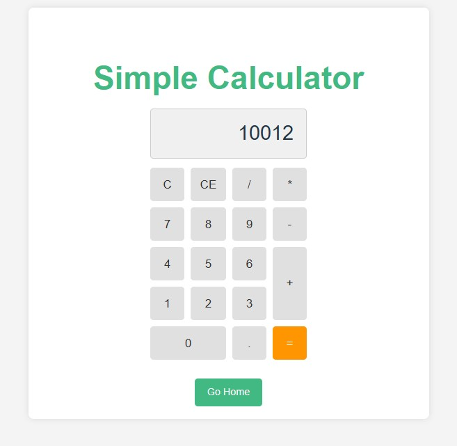

# My Vue Calculator

A simple calculator built with Vue.js and Vite with router4.

## Features

*   Basic arithmetic operations
*   Navigation between home and calculator pages

## Screenshot




### Installation

1.  **Clone the repository:**
    If you don't have the project locally yet, clone it from Git:
    ```bash
    git clone https://github.com/versiongit/vue-calculator.git
    cd vue-calculator
    ```

2.  **Install Dependencies:**
    Navigate to the project's root directory in your terminal and install all the necessary packages:
    ```bash
    npm install
    ```

### Running the Project

1.  **Start the Development Server:**
    To run the project in development mode with hot-reloading, use the following command:
    ```bash
    npm run dev
    ```

    This will start a local development server, usually accessible at `http://localhost:5173/`. Open your browser to this address to see the calculator in action.

### Building for Production

To create an optimized build of the application for deployment, run:
```bash
npm run build
